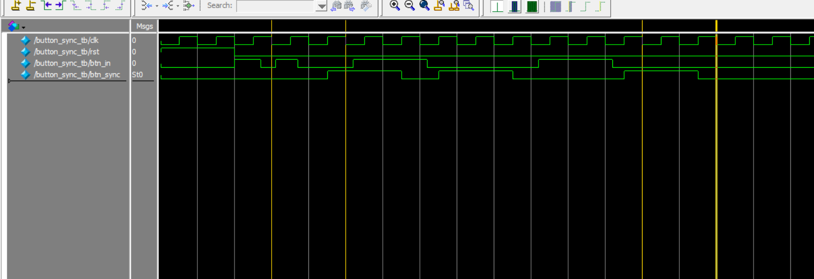

# Verilog Button Synchronizer

This project implements a **two-flip-flop synchronizer** for external asynchronous button inputs to a synchronous system clock domain in Verilog.

---

## 📂 Files Included
- `button_sync.v` — Verilog source code for button synchronization
- `button_sync_tb.v` — Testbench to verify the design
- `button_sync.vcd` — VCD waveform dump from simulation
- `monitor_log.txt` — (Optional) Simulation output log
- `wave_button_sync_tb.png` — Waveform screenshot from ModelSim
- `RTL_button_sync.pdf` — RTL schematic generated from Quartus Prime

---

## 🧠 Design Overview

- External **asynchronous** button input (`btn_in`) might cause **metastability** if sampled directly by system clock.
- To solve this, a **2-stage synchronizer** is used:
  - First flip-flop (sync_ff1) captures the asynchronous signal.
  - Second flip-flop (sync_ff2) synchronizes it to the system clock.
  - Final output (`btn_sync`) is stable and safe.

---

## 🖥️ RTL Schematic
RTL schematic generated by Quartus Prime:

📎 **[View RTL Diagram (PDF)](RTL_button_sync.pdf)**

---

## 🌊 Waveform

Simulation waveform captured by ModelSim:

**Observation:**
- When `btn_in` toggles, `btn_sync` changes after **two clock cycles**.
- It ensures stable transition into clock domain and avoids metastability.

---

## 🛠️ Tools Used
- **Quartus Prime** – RTL design, synthesis, and schematic generation
- **ModelSim** – Simulation and waveform viewing
- **Verilog HDL** – Hardware description language

---

## ✅ Simulation Result

All logic was tested and verified successfully in ModelSim.  
The design ensures **safe synchronization** for asynchronous button signals into a synchronous system.

---
